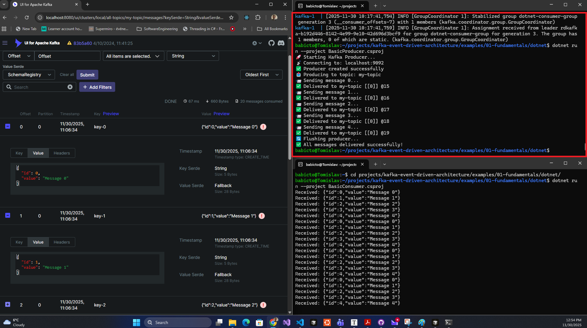
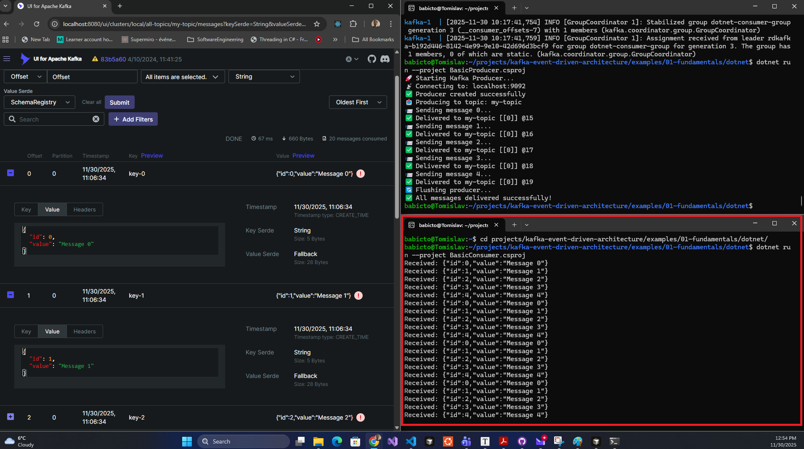
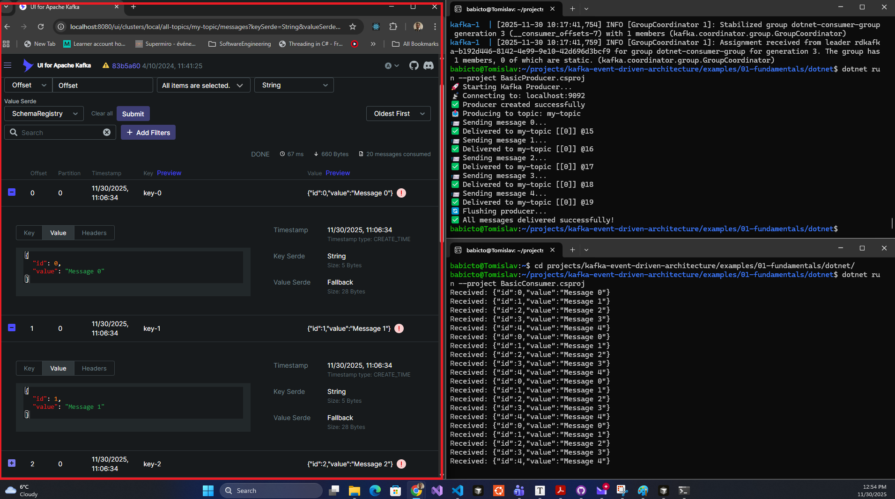
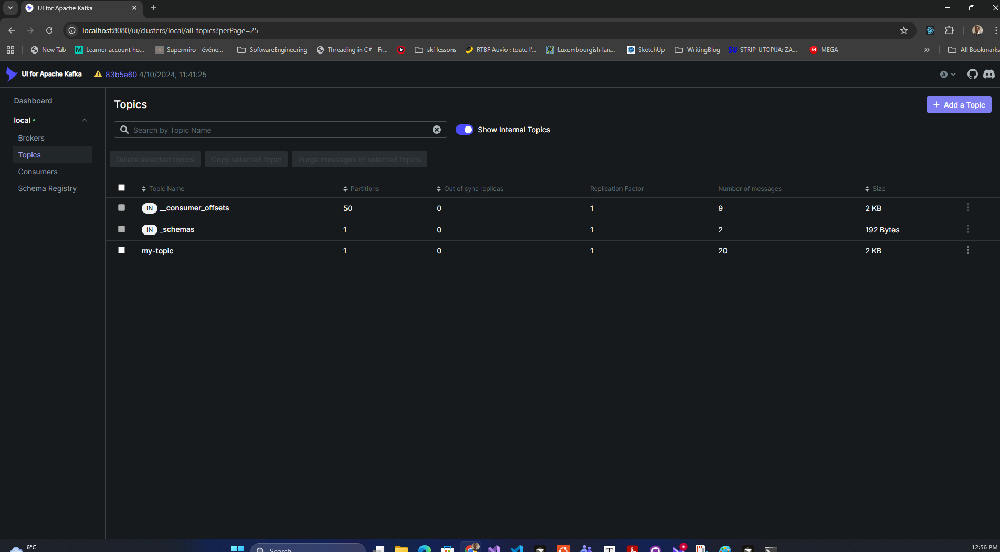
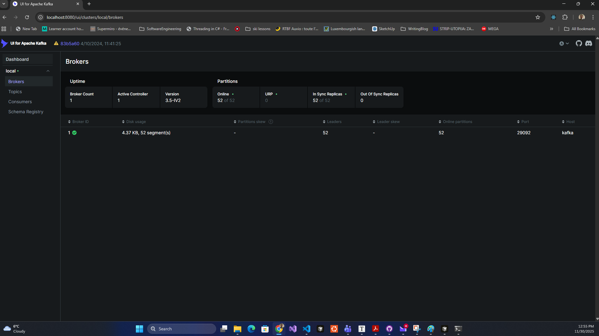
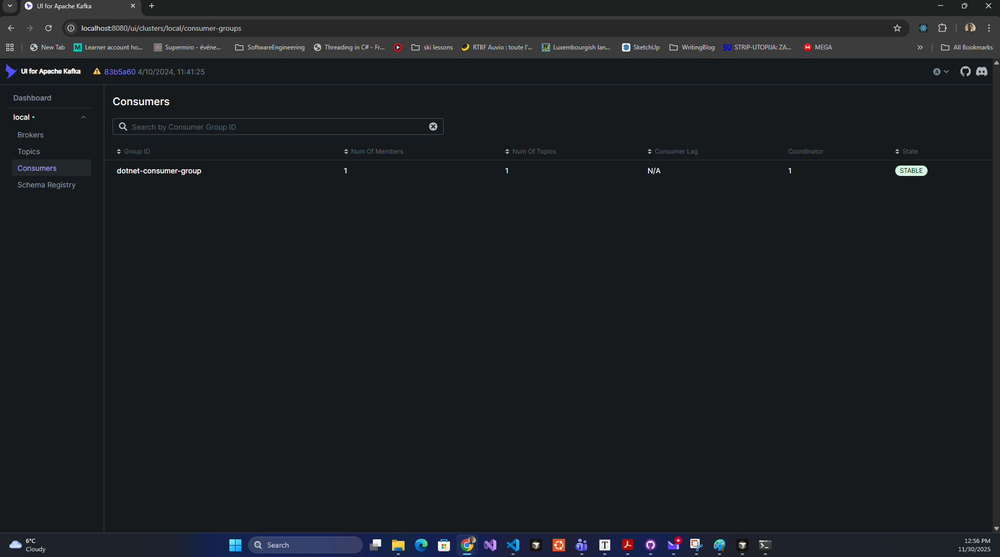

# 📚 Complete Guide: Running the 01-Fundamentals Example

This guide explains the complete workflow for running the Kafka fundamentals example with all components.

---

## 🎯 Overview

The fundamentals example demonstrates basic Kafka producer/consumer patterns using:
- **Kafka Broker** (message storage/routing)
- **Zookeeper** (Kafka cluster coordination)
- **Schema Registry** (schema management)
- **Kafka UI** (web interface for monitoring)
- **Your Code** (Producer sends messages, Consumer reads them)

---

## 📋 Step-by-Step Execution Flow

### **Step 1: Start Docker Daemon** (WSL only)

Since you're on WSL without Docker Desktop, the Docker daemon needs to be running first.

```bash
cd /home/babicto/projects/kafka-event-driven-architecture
./scripts/start-docker.sh
```

**What happens:**
- Checks if Docker Engine is installed
- Starts the Docker daemon process (`dockerd`)
- Verifies Docker is responding

**Expected output:**
```
🐳 Starting Docker service...
✅ Docker started successfully
Docker version 29.1.1, build 0aedba5
Docker Compose version v2.40.3
```

---

### **Step 2: Start Kafka Infrastructure**

This starts all the Kafka-related containers defined in `docker-compose.yml`.

```bash
./scripts/start-kafka.sh
```

**What happens behind the scenes:**

1. **Docker Compose reads** `docker-compose.yml`
2. **Creates a Docker network** for inter-container communication
3. **Starts containers in order:**
   - **Zookeeper first** (port 2181) - required by Kafka
   - **Kafka Broker** (port 9092) - waits for Zookeeper
   - **Schema Registry** (port 8081) - waits for Kafka
   - **Kafka UI** (port 8080) - waits for Kafka

4. **Downloads images** (first time only):
   - `confluentinc/cp-zookeeper:7.5.0`
   - `confluentinc/cp-kafka:7.5.0`
   - `confluentinc/cp-schema-registry:7.5.0`
   - `provectuslabs/kafka-ui:latest`

**Expected output:**
```
🚀 Starting Kafka infrastructure...
[+] Running 5/5
 ✔ Network kafka-event-driven-architecture_default
 ✔ Container ...zookeeper-1        Started
 ✔ Container ...kafka-1            Started
 ✔ Container ...kafka-ui-1         Started
 ✔ Container ...schema-registry-1  Started

✅ Kafka services started successfully!

Services:
  • Kafka Broker:      localhost:9092
  • Zookeeper:         localhost:2181
  • Schema Registry:   localhost:8081
  • Kafka UI:          http://localhost:8080
```

---

### **Step 3: Verify Everything is Running**

This checks that Kafka is actually ready to accept connections.

```bash
./scripts/verify-docker.sh
```

**What it checks:**

1. **Docker daemon** is running
2. **All containers** are in "Up" state
3. **Kafka connectivity** - tries to connect and fetch broker metadata
4. **API responsiveness** - ensures Kafka is accepting requests

**Expected output:**
```
Verifying Docker setup...

Checking Docker Compose services...
NAME                                    STATUS
kafka-event-driven-architecture-kafka-1 Up
kafka-event-driven-architecture-...     Up

Checking Kafka connectivity...
localhost:9092 (id: 1 rack: null) -> (...)

━━━━━━━━━━━━━━━━━━━━━━━━━━━━━━━━━━━━━━━━
✅ All services are running!

Access Kafka UI: http://localhost:8080
━━━━━━━━━━━━━━━━━━━━━━━━━━━━━━━━━━━━━━━━
```

**If Kafka isn't ready yet:**
```
⚠️  Services are starting or not fully ready yet
Try running this script again in a few seconds
```

Just wait 10-20 seconds and run it again. Kafka takes a moment to fully initialize.

---

### **Step 4: Run the C# Producer**

Navigate to the dotnet example and run the producer first.

```bash
cd examples/01-fundamentals/dotnet
dotnet run --project BasicProducer.csproj
```

**What happens:**

1. **.NET compiles** the `BasicProducer.cs` code
2. **Creates ProducerConfig** pointing to `localhost:9092`
3. **Connects to Kafka** broker
4. **Creates topic** `my-topic` (auto-created by Kafka)
5. **Sends 5 messages** in a loop (i = 0 to 4):
   - Key: `key-0`, `key-1`, etc.
   - Value: JSON like `{"id":0,"value":"Message 0"}`
6. **Waits for acknowledgment** from Kafka for each message
7. **Flushes** any pending messages
8. **Exits**

**Expected output:**
```
🚀 Starting Kafka Producer...
📡 Connecting to: localhost:9092
✅ Producer created successfully
📤 Producing to topic: my-topic
📨 Sending message 0...
✅ Delivered to my-topic [[0]] @0
📨 Sending message 1...
✅ Delivered to my-topic [[0]] @1
📨 Sending message 2...
✅ Delivered to my-topic [[0]] @2
📨 Sending message 3...
✅ Delivered to my-topic [[0]] @3
📨 Sending message 4...
✅ Delivered to my-topic [[0]] @4
🔄 Flushing producer...
✅ All messages delivered successfully!
```

**What this means:**
- `my-topic` = topic name
- `[[0]]` = partition number (topics have partitions)
- `@0`, `@1`, etc. = offset (position in the partition)

The messages are now **stored in Kafka**, waiting to be consumed.

**✅ Success!** Here's what a successful producer run looks like:


*Producer successfully delivering 5 messages to Kafka*

---

### **Step 5: Run the C# Consumer**

Open a **new terminal** (keep the same directory) and run the consumer.

```bash
# In a NEW terminal window:
cd /home/babicto/projects/kafka-event-driven-architecture/examples/01-fundamentals/dotnet
dotnet run --project BasicConsumer.csproj
```

**What happens:**

1. **.NET compiles** `BasicConsumer.cs`
2. **Creates ConsumerConfig:**
   - Bootstrap servers: `localhost:9092`
   - Consumer group: `dotnet-consumer-group`
   - Auto offset reset: `Earliest` (read from beginning)
3. **Connects to Kafka** and joins the consumer group
4. **Subscribes to** `my-topic`
5. **Kafka assigns** partition(s) to this consumer
6. **Starts polling** for messages from offset 0 (earliest)
7. **Reads all 5 messages** we produced earlier
8. **Prints each message** to console
9. **Keeps running** and polling for new messages (blocking)

**Expected output:**
```
Received: {"id":0,"value":"Message 0"}
Received: {"id":1,"value":"Message 1"}
Received: {"id":2,"value":"Message 2"}
Received: {"id":3,"value":"Message 3"}
Received: {"id":4,"value":"Message 4"}
(cursor blinking, waiting for more messages...)
```

The consumer is now **running continuously**, waiting for new messages. Press **Ctrl+C** to stop it.

**✅ Success!** Here's what a successful consumer run looks like:


*Consumer successfully receiving messages from Kafka*

---

### **Step 6: Test Real-Time Messaging** (Optional)

To see real-time message flow:

**Terminal 1 - Keep Consumer Running:**
```bash
# Already running from Step 5
# Shows: (waiting for messages...)
```

**Terminal 2 - Run Producer Again:**
```bash
cd /home/babicto/projects/kafka-event-driven-architecture/examples/01-fundamentals/dotnet
dotnet run --project BasicProducer.csproj
```

**What you'll see:**

- **Terminal 2** (Producer) sends 5 more messages
- **Terminal 1** (Consumer) **immediately displays** the new messages

This demonstrates Kafka's **real-time streaming** capability!

---

### **Step 7: View in Kafka UI** (Optional but Awesome!)

Open your browser to: **http://localhost:8080**

The Kafka UI provides a visual interface to explore your Kafka cluster, topics, messages, and consumer groups.

**What you can see:**

#### 1. **Messages View**

Navigate to: **Topics** → **my-topic** → **Messages**


*Viewing messages in the Kafka UI - showing all 20 messages with keys, values, and timestamps*

**Features:**
- See all messages with their keys and values
- JSON formatted nicely
- Timestamps of when they were produced
- Filter by offset, partition, or search
- View message headers and metadata

#### 2. **Topics View**

Navigate to: **Topics**


*Topics list showing my-topic with 20 messages, 1 partition, and replication factor 1*

**What you'll see:**
- `my-topic` with message count (20 messages shown)
- 1 partition (default for auto-created topics)
- Replication factor: 1
- Size: 2 KB
- Internal topics (`__consumer_offsets`, `__schemas`) are also visible

#### 3. **Brokers View**

Navigate to: **Brokers**


*Broker information showing broker ID 1, online partitions, and system metrics*

**Information displayed:**
- Broker ID: 1
- Status: Online (green checkmark)
- Disk usage: 4.37 KB, 52 segments
- Online partitions: 52 of 52
- Leaders: 52
- Port: 29092
- Host: kafka

#### 4. **Consumers View**

Navigate to: **Consumers**


*Consumer groups showing dotnet-consumer-group in STABLE state*

**What you'll see:**
- Consumer Group: `dotnet-consumer-group`
- State: **STABLE** (green badge)
- Number of Members: 1
- Number of Topics: 1
- Coordinator: Broker 1
- Consumer Lag: N/A (or 0 if caught up)

**💡 Pro Tip:** Keep the Kafka UI open while running producers and consumers to see real-time updates!

---

## 🔄 The Complete Message Flow

Here's what happens under the hood:

```
Producer (C#)
    ↓
Creates Message { key, value }
    ↓
Serializes to bytes
    ↓
Sends to Kafka Broker (localhost:9092)
    ↓
Kafka writes to disk (partition 0 of my-topic)
    ↓
Kafka sends ACK back to Producer
    ↓
Producer prints "Delivered to..."
    
    [Message is now stored in Kafka]
    
Consumer (C#) continuously polls
    ↓
Kafka checks: "What's your offset?"
    ↓
Consumer: "I'm at offset 5"
    ↓
Kafka: "Here's message at offset 5"
    ↓
Consumer deserializes bytes → string
    ↓
Consumer prints "Received: ..."
    ↓
Consumer commits offset: "I'm now at offset 6"
    ↓
Loop back to polling...
```

---

## 🧩 Component Relationships

```
┌─────────────────────────────────────────┐
│          Your Application               │
│  ┌──────────────┐  ┌─────────────────┐ │
│  │   Producer   │  │    Consumer     │ │
│  │ (sends msgs) │  │  (reads msgs)   │ │
│  └──────┬───────┘  └────────┬────────┘ │
└─────────┼────────────────────┼──────────┘
          │                    │
          ↓                    ↓
    ┌─────────────────────────────────┐
    │      Kafka Broker :9092         │
    │  ┌───────────────────────────┐  │
    │  │  Topic: my-topic          │  │
    │  │  ├─ Partition 0 (10 msgs) │  │
    │  └───────────────────────────┘  │
    │         ↕                        │
    │  ┌───────────────────────────┐  │
    │  │  Zookeeper :2181          │  │
    │  │  (cluster coordination)   │  │
    │  └───────────────────────────┘  │
    └─────────────────────────────────┘
                 ↕
    ┌─────────────────────────────────┐
    │   Schema Registry :8081         │
    │   (for Avro/JSON schemas)       │
    └─────────────────────────────────┘
                 ↕
    ┌─────────────────────────────────┐
    │      Kafka UI :8080             │
    │   (web-based monitoring)        │
    └─────────────────────────────────┘
```

---

## 🎯 Key Concepts Demonstrated

1. **Producer-Consumer Pattern:**
   - Producer writes data to Kafka
   - Consumer reads data from Kafka
   - They don't know about each other (decoupled)

2. **Topics & Partitions:**
   - Messages organized into topics
   - Topics divided into partitions for scalability
   - Each message gets an offset (position number)

3. **Consumer Groups:**
   - Consumers belong to groups
   - Kafka tracks what each group has read
   - If consumer crashes, another can pick up where it left off

4. **At-Least-Once Delivery:**
   - Messages are persisted to disk
   - Consumers can re-read old messages
   - Data isn't lost if consumer crashes

---

## 🛑 Shutting Down

**Stop Consumer:**
```
Press Ctrl+C in the consumer terminal
```

**Stop Kafka Infrastructure:**
```bash
cd /home/babicto/projects/kafka-event-driven-architecture
docker compose down
```

**Stop and Delete Data:**
```bash
docker compose down -v
```

This removes all messages and topics (clean slate).

---

## 🚀 Quick Reference Commands

```bash
# Start everything
./scripts/start-kafka.sh
./scripts/verify-docker.sh

# Run producer
cd examples/01-fundamentals/dotnet
dotnet run --project BasicProducer.csproj

# Run consumer (in new terminal)
cd examples/01-fundamentals/dotnet
dotnet run --project BasicConsumer.csproj

# View Kafka UI
Open: http://localhost:8080

# Stop everything
docker compose down
```

---

## 🐛 Troubleshooting

**Kafka won't start?**
```bash
./scripts/fix-kafka.sh
```

**Need to diagnose issues?**
```bash
./scripts/diagnose-kafka.sh
```

**See full troubleshooting guide:**
```bash
cat ../../docs/TROUBLESHOOTING.md
```

---

That's it! You now understand how all the Kafka components work together to enable distributed messaging. 🎉

