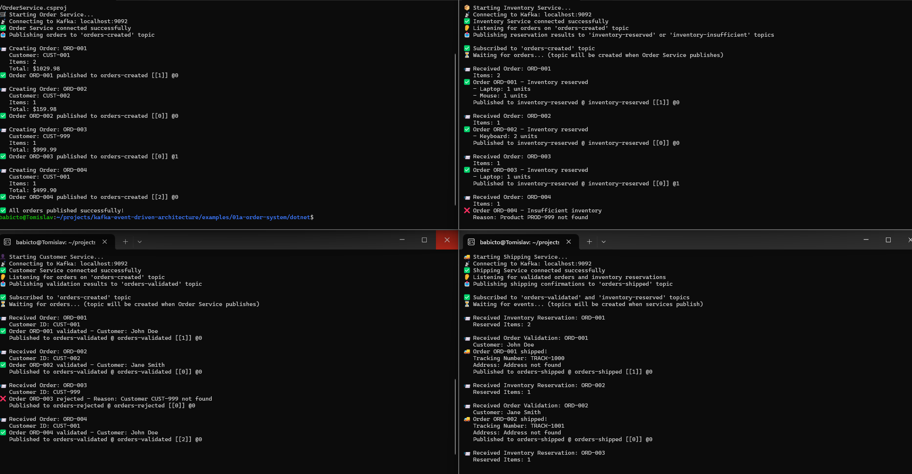
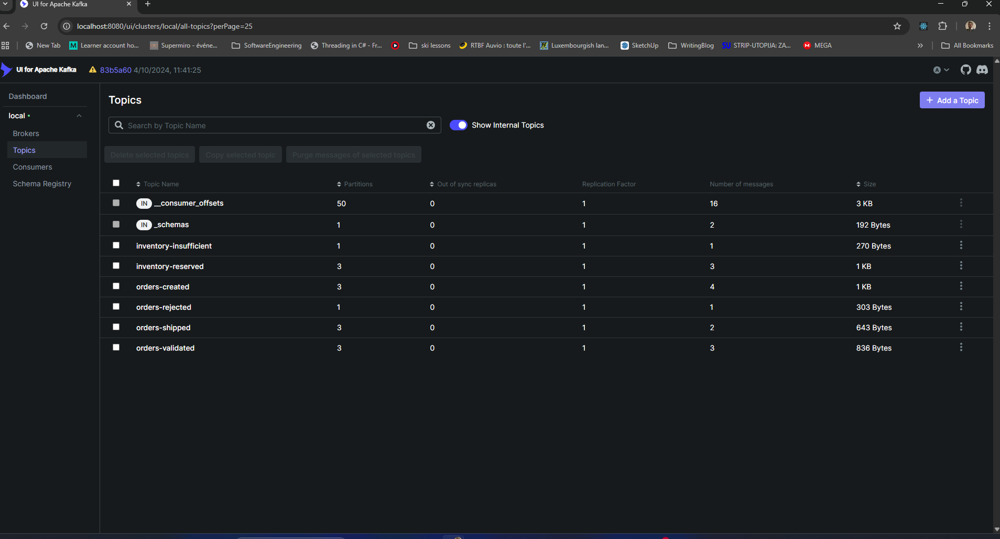
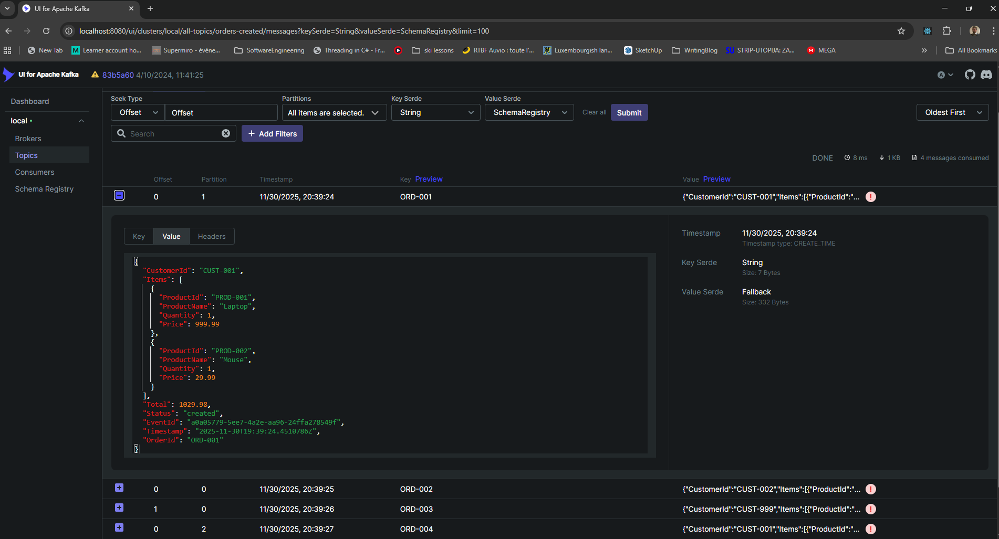

# How to Run the Order System Example

Complete step-by-step guide for running the event-driven order system.

---

## 🎯 Prerequisites

- Kafka running (see main project setup)
- .NET 8.0 SDK installed
- 4 terminal windows available

---

## 📋 Step-by-Step Guide

### **Step 1: Start Kafka Infrastructure**

```bash
cd /home/babicto/projects/kafka-event-driven-architecture
./scripts/start-kafka.sh
./scripts/verify-docker.sh
```

**Expected:** All Kafka services running and accessible.

---

### **Step 2: Build All Services**

```bash
cd examples/01a-order-system/dotnet

# Build all projects
dotnet build OrderService/OrderService.csproj
dotnet build CustomerService/CustomerService.csproj
dotnet build InventoryService/InventoryService.csproj
dotnet build ShippingService/ShippingService.csproj
```

**Expected:** All projects build successfully.

**💡 Command Reference:**
- **Build:** `dotnet build <project>.csproj`
- **Run:** `dotnet run --project <project>.csproj` ← Note the `run` command!

---

### **Step 2.5: Create Topics** (Recommended)

**⚠️ Important:** Consumers cannot subscribe to topics that don't exist. While topics are auto-created when producers publish, consumers will fail if they try to subscribe before the topic exists.

**Solution 1: Create Topics Manually (Recommended)**

Run the helper script to create all topics:

```bash
cd examples/01a-order-system/dotnet
./create-topics.sh
```

**Solution 2: Start Order Service First**

If you don't create topics manually, start Order Service first to create `orders-created`, then start the consumers.

**Topics that need to exist:**
- `orders-created` - Required for Customer and Inventory Services
- `orders-validated` - Required for Shipping Service
- `inventory-reserved` - Required for Shipping Service
- `orders-rejected` - Created automatically when needed
- `inventory-insufficient` - Created automatically when needed
- `orders-shipped` - Created automatically when needed

**Manual topic creation** (if you want custom settings):

```bash
# Create topics with specific partitions and replication
docker compose exec kafka kafka-topics --create \
  --bootstrap-server localhost:9092 \
  --topic orders-created \
  --partitions 3 \
  --replication-factor 1

docker compose exec kafka kafka-topics --create \
  --bootstrap-server localhost:9092 \
  --topic orders-validated \
  --partitions 3 \
  --replication-factor 1

docker compose exec kafka kafka-topics --create \
  --bootstrap-server localhost:9092 \
  --topic orders-rejected \
  --partitions 1 \
  --replication-factor 1

docker compose exec kafka kafka-topics --create \
  --bootstrap-server localhost:9092 \
  --topic inventory-reserved \
  --partitions 3 \
  --replication-factor 1

docker compose exec kafka kafka-topics --create \
  --bootstrap-server localhost:9092 \
  --topic inventory-insufficient \
  --partitions 1 \
  --replication-factor 1

docker compose exec kafka kafka-topics --create \
  --bootstrap-server localhost:9092 \
  --topic orders-shipped \
  --partitions 3 \
  --replication-factor 1
```

**Note:** The `create-topics.sh` script creates topics with 3 partitions (better for production-like scenarios). If you don't create topics manually, they will be auto-created with default settings (1 partition, 1 replication factor) when the first message is published.

**Verify topics exist:**
```bash
docker compose exec kafka kafka-topics --list --bootstrap-server localhost:9092
```

**💡 Error Handling:** The services now handle missing topics gracefully - they will wait and retry if topics don't exist yet. However, it's still recommended to create topics first for a smoother experience.

---

### **Step 3: Start Customer Service**

**Terminal 1:**

```bash
cd examples/01a-order-system/dotnet
dotnet run --project CustomerService/CustomerService.csproj
```

**Expected output:**
```
👤 Starting Customer Service...
📡 Connecting to Kafka: localhost:9092
✅ Customer Service connected successfully
👂 Listening for orders on 'orders-created' topic
📤 Publishing validation results to 'orders-validated' topic
✅ Subscribed to 'orders-created' topic
⏳ Waiting for orders... (topic will be created when Order Service publishes)
```

**Note:** If the topic doesn't exist yet, the service will wait gracefully. If you see "Topic not available" errors, run `./create-topics.sh` first.

**What it does:**
- Consumes `orders-created` events
- Validates customer exists and is active
- Publishes to `orders-validated` or `orders-rejected`

---

### **Step 4: Start Inventory Service**

**Terminal 2:**

```bash
cd examples/01a-order-system/dotnet
dotnet run --project InventoryService/InventoryService.csproj
```

**Expected output:**
```
📦 Starting Inventory Service...
📡 Connecting to Kafka: localhost:9092
✅ Inventory Service connected successfully
👂 Listening for orders on 'orders-created' topic
📤 Publishing reservation results to 'inventory-reserved' or 'inventory-insufficient' topics
```

**What it does:**
- Consumes `orders-created` events
- Checks product availability
- Reserves inventory
- Publishes to `inventory-reserved` or `inventory-insufficient`

---

### **Step 5: Start Shipping Service**

**Terminal 3:**

```bash
cd examples/01a-order-system/dotnet
dotnet run --project ShippingService/ShippingService.csproj
```

**Expected output:**
```
🚚 Starting Shipping Service...
📡 Connecting to Kafka: localhost:9092
✅ Shipping Service connected successfully
👂 Listening for validated orders and inventory reservations
📤 Publishing shipping confirmations to 'orders-shipped' topic
```

**What it does:**
- Consumes `orders-validated` and `inventory-reserved` events
- Waits for BOTH conditions
- Creates shipping label
- Publishes to `orders-shipped`

---

### **Step 6: Create Orders (Order Service)**

**Terminal 4:**

```bash
cd examples/01a-order-system/dotnet
dotnet run --project OrderService/OrderService.csproj
```

**💡 Note:** Make sure to include `run` in the command: `dotnet run --project` (not just `dotnet --project`)

**Expected output:**
```
🛒 Starting Order Service...
📡 Connecting to Kafka: localhost:9092
✅ Order Service connected successfully
📤 Publishing orders to 'orders-created' topic

📨 Creating Order: ORD-001
   Customer: CUST-001
   Items: 2
   Total: $1029.98
✅ Order ORD-001 published to my-topic [[0]] @0

📨 Creating Order: ORD-002
   Customer: CUST-002
   Items: 1
   Total: $159.98
✅ Order ORD-002 published to my-topic [[0]] @1

📨 Creating Order: ORD-003
   Customer: CUST-999
   Items: 1
   Total: $999.99
✅ Order ORD-003 published to my-topic [[0]] @2

📨 Creating Order: ORD-004
   Customer: CUST-001
   Items: 1
   Total: $499.90
✅ Order ORD-004 published to my-topic [[0]] @3

✅ All orders published successfully!
```

**What happens:**
- Creates 4 sample orders
- **Topics are auto-created** when Order Service publishes the first message to `orders-created`
- ORD-001: Valid customer, valid inventory → Will be shipped ✅
- ORD-002: Valid customer, valid inventory → Will be shipped ✅
- ORD-003: Invalid customer → Will be rejected ❌
- ORD-004: Valid customer, insufficient inventory → Will fail ❌

**💡 Topic Creation Note:** When Order Service publishes the first order, Kafka automatically creates the `orders-created` topic. Similarly, other topics (`orders-validated`, `inventory-reserved`, etc.) are created when their respective services publish their first messages.

---

### **Step 7: Observe Event Flow**

Watch the terminals to see events flow through the system:

**Terminal 1 (Customer Service):**
```
📨 Received Order: ORD-001
   Customer ID: CUST-001
✅ Order ORD-001 validated - Customer: John Doe
   Published to orders-validated @ ...

📨 Received Order: ORD-002
   Customer ID: CUST-002
✅ Order ORD-002 validated - Customer: Jane Smith
   Published to orders-validated @ ...

📨 Received Order: ORD-003
   Customer ID: CUST-999
❌ Order ORD-003 rejected - Reason: Customer CUST-999 not found
   Published to orders-rejected @ ...

📨 Received Order: ORD-004
   Customer ID: CUST-001
✅ Order ORD-004 validated - Customer: John Doe
   Published to orders-validated @ ...
```

**Terminal 2 (Inventory Service):**
```
📨 Received Order: ORD-001
   Items: 2
✅ Order ORD-001 - Inventory reserved
   - Laptop: 1 units
   - Mouse: 1 units
   Published to inventory-reserved @ ...

📨 Received Order: ORD-002
   Items: 1
✅ Order ORD-002 - Inventory reserved
   - Keyboard: 2 units
   Published to inventory-reserved @ ...

📨 Received Order: ORD-003
   Items: 1
✅ Order ORD-003 - Inventory reserved
   - Laptop: 1 units
   Published to inventory-reserved @ ...

📨 Received Order: ORD-004
   Items: 1
❌ Order ORD-004 - Insufficient inventory
   Reason: Insufficient stock for Out of Stock Item. Available: 0, Requested: 10
   Published to inventory-insufficient @ ...
```

**Terminal 3 (Shipping Service):**
```
📨 Received Order Validation: ORD-001
   Customer: John Doe
📨 Received Inventory Reservation: ORD-001
   Reserved Items: 2
🚚 Order ORD-001 shipped!
   Tracking Number: TRACK-1000
   Address: 123 Main St, New York, NY 10001
   Published to orders-shipped @ ...

📨 Received Order Validation: ORD-002
   Customer: Jane Smith
📨 Received Inventory Reservation: ORD-002
   Reserved Items: 1
🚚 Order ORD-002 shipped!
   Tracking Number: TRACK-1001
   Address: 456 Oak Ave, Los Angeles, CA 90001
   Published to orders-shipped @ ...

📨 Received Order Validation: ORD-004
   Customer: John Doe
(Waiting for inventory reservation...)
```

**✅ Success!** Here's what all 4 services running together looks like:


*All 4 microservices running simultaneously - Order Service, Customer Service, Inventory Service, and Shipping Service processing events*

---

## 🎨 View in Kafka UI

Open **http://localhost:8080** to see the complete event flow visually.

### **Topics Overview**

Navigate to: **Topics**


*Kafka UI showing all order system topics with message counts, partitions, and sizes*

**What you'll see:**
- `orders-created` - 4 messages (all orders created)
- `orders-validated` - 3 messages (ORD-001, ORD-002, ORD-004)
- `orders-rejected` - 1 message (ORD-003)
- `inventory-reserved` - 3 messages (ORD-001, ORD-002, ORD-003)
- `inventory-insufficient` - 1 message (ORD-004)
- `orders-shipped` - 2 messages (ORD-001, ORD-002)

**Topic Details:**
- Main topics (`orders-created`, `orders-validated`, `inventory-reserved`, `orders-shipped`) have **3 partitions** (created with `create-topics.sh`)
- Error/rejection topics have **1 partition**
- All topics have replication factor **1**

### **View Messages**

Navigate to: **Topics** → **orders-created** → **Messages**


*Viewing messages in orders-created topic - showing order details with JSON structure*

**What you'll see:**
- All 4 orders (ORD-001 through ORD-004)
- Full JSON structure with:
  - Order ID, Customer ID
  - Items array with ProductId, ProductName, Quantity, Price
  - Total amount
  - Event metadata (EventId, Timestamp)
- Messages distributed across partitions (0, 1, 2)
- Timestamps showing when each order was created

**Try exploring other topics:**
- `orders-validated` - See validated orders with customer names
- `orders-rejected` - See rejected orders with rejection reasons
- `inventory-reserved` - See inventory reservations
- `orders-shipped` - See shipped orders with tracking numbers

---

## 🔍 Understanding the Flow

### Successful Order Flow (ORD-001, ORD-002)

1. **Order Service** → Creates order → `orders-created`
2. **Customer Service** → Validates → `orders-validated`
3. **Inventory Service** → Reserves → `inventory-reserved`
4. **Shipping Service** → Receives both → Ships → `orders-shipped`

### Rejected Order Flow (ORD-003)

1. **Order Service** → Creates order → `orders-created`
2. **Customer Service** → Rejects (customer not found) → `orders-rejected`
3. **Inventory Service** → Still reserves (doesn't know about rejection)
4. **Shipping Service** → Never ships (missing validation)

### Failed Order Flow (ORD-004)

1. **Order Service** → Creates order → `orders-created`
2. **Customer Service** → Validates → `orders-validated`
3. **Inventory Service** → Fails (insufficient stock) → `inventory-insufficient`
4. **Shipping Service** → Never ships (missing inventory reservation)

---

### **Consumer Groups**

Navigate to: **Consumers**

**What you'll see:**
- `customer-service-group` - Consuming orders-created
- `inventory-service-group` - Consuming orders-created
- `shipping-service-group` - Consuming orders-validated and inventory-reserved

Each consumer group shows:
- Number of members
- Number of topics consumed
- Consumer lag
- Coordinator broker
- State (STABLE when running)

---

## 🛑 Stopping Services

Press **Ctrl+C** in each terminal to stop the services gracefully.

---

## 🔧 Troubleshooting

### Services not receiving messages?

1. Check Kafka is running: `docker compose ps`
2. Verify topics exist: 
   ```bash
   # List all topics
   docker compose exec kafka kafka-topics --list --bootstrap-server localhost:9092
   
   # Or check Kafka UI at http://localhost:8080
   ```
3. Check consumer groups: Kafka UI → Consumers tab
4. Restart services in order: Customer → Inventory → Shipping → Order

### Topics not created or "Topic not available" error?

**Solution 1: Create topics manually (Recommended)**
```bash
cd examples/01a-order-system/dotnet
./create-topics.sh
```

**Solution 2: Check auto-create is enabled:**
```bash
docker compose exec kafka kafka-configs --bootstrap-server localhost:9092 \
  --entity-type brokers --entity-name 1 --describe | grep auto.create
```
Should show: `auto.create.topics.enable=true`

**Solution 3: Start Order Service first**
If topics aren't created manually, start Order Service first to create `orders-created`, then start consumers.

**Solution 4: Check Kafka logs:**
```bash
docker compose logs kafka | grep -i topic
```

**Note:** The services now handle missing topics gracefully with retry logic, but creating topics first is still recommended.

### Build errors?

```bash
# Clean and rebuild
dotnet clean
dotnet build
```

### Port conflicts?

```bash
# Stop Kafka and restart
docker compose down
./scripts/start-kafka.sh
```

---

## 📚 Key Concepts Demonstrated

- ✅ **Event-Driven Architecture** - Services communicate via events
- ✅ **Decoupling** - Services don't know about each other
- ✅ **Error Handling** - Rejection flows for invalid data
- ✅ **Event Dependencies** - Shipping waits for multiple events
- ✅ **Topic-Based Routing** - Different topics for different event types
- ✅ **Consumer Groups** - Each service has its own group

---

## 🎯 Next Steps

- Modify order data in `OrderProducer.cs`
- Add more validation rules
- Implement order cancellation
- Add more services (Payment, Notification, etc.)

---

**Happy Event Streaming! 🚀**

