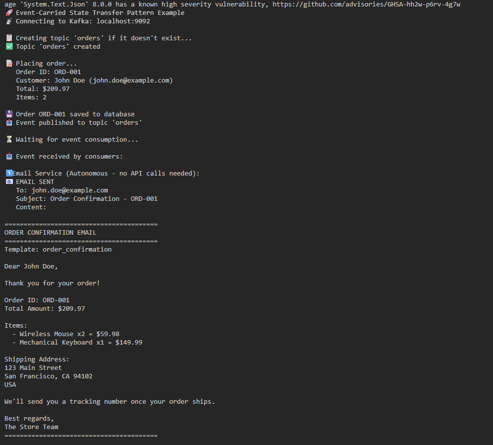
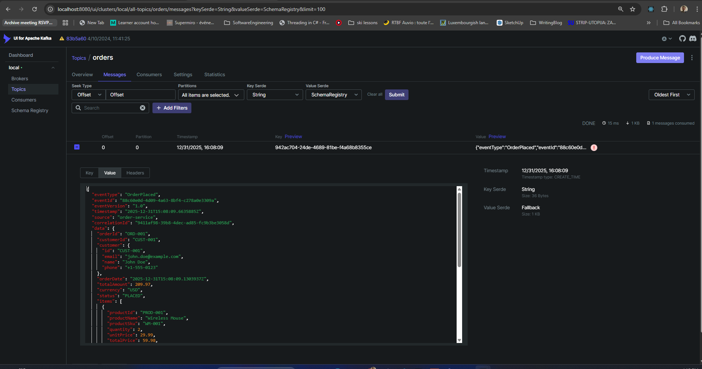

# How to Run: Event-Carried State Transfer Pattern

This guide walks you through running the Event-Carried State Transfer pattern example.

## Prerequisites

- .NET 8.0 SDK installed
- Docker and Docker Compose installed
- Kafka running (see setup below)

## Step 1: Start Kafka

Make sure Kafka is running:

```bash
cd /home/babicto/projects/kafka-event-driven-architecture
./scripts/start-kafka.sh
```

Wait for Kafka to be ready:

```bash
./scripts/verify-docker.sh
```

**If services are not ready after waiting for 30 seconds then you can run:**
```bash
cd /home/babicto/projects/kafka-event-driven-architecture
./scripts/fix-kafka.sh
```

**Expected:** All Kafka services running and accessible.

## Step 2: Build the Solution

```bash
cd examples/02-core-concepts/dotnet/event-carried-state-trf
dotnet build EventCarriedStateTransfer.sln
```

**Expected:** Build succeeds with no errors.

## Step 3: Run the Example

```bash
dotnet run --project Examples/Examples.csproj
```

**Expected Output:**

```
🚀 Event-Carried State Transfer Pattern Example
📡 Connecting to Kafka: localhost:9092

📋 Creating topic 'orders' if it doesn't exist...
✅ Topic 'orders' created

📝 Placing order...
   Order ID: ORD-001
   Customer: John Doe (john.doe@example.com)
   Total: $209.97
   Items: 2

💾 Order ORD-001 saved to database
📤 Event published to topic 'orders'

⏳ Waiting for event consumption...

📥 Event received by consumers:

1️⃣ Email Service (Autonomous - no API calls needed):
📧 EMAIL SENT
   To: john.doe@example.com
   Subject: Order Confirmation - ORD-001
   Content:
========================================
ORDER CONFIRMATION EMAIL
========================================
Template: order_confirmation

Dear John Doe,

Thank you for your order!

Order ID: ORD-001
Total Amount: $209.97

Items:
  - Wireless Mouse x2 = $59.98
  - Mechanical Keyboard x1 = $149.99

Shipping Address:
123 Main Street
San Francisco, CA 94102
USA

We'll send you a tracking number once your order ships.

Best regards,
The Store Team
========================================

2️⃣ Inventory Service (Autonomous - all data in event):
   📦 Reduced stock: PROD-001 by 2 (remaining: 98)
   📦 Reduced stock: PROD-002 by 1 (remaining: 49)
✅ Inventory updated for order ORD-001

3️⃣ Analytics Service (Autonomous - complete metrics):
📊 ANALYTICS RECORDED:
   Event Type: order_placed
   Order ID: ORD-001
   Customer ID: CUST-001
   Amount: USD 209.97
   Item Count: 2
   Country: USA

✅ Event-Carried State Transfer Pattern demonstrated!

💡 Key Benefits:
   • Services are fully autonomous
   • No API calls needed between services
   • All necessary data is in the event
   • Services can operate independently
   • Better resilience and scalability
```

**Example Output Screenshot:**



*Terminal output showing the Event-Carried State Transfer pattern example running successfully, demonstrating autonomous services processing events with full data.*

## Step 4: View Events in Kafka UI

1. Open Kafka UI: http://localhost:8080
2. Navigate to: **Topics** → **orders** → **Messages**
3. View the published event with all the data

**Kafka UI Screenshot:**



*Kafka UI showing the OrderPlaced event in the "orders" topic. Notice how the event contains all necessary data (order details, customer info, items, shipping address, payment info) - demonstrating the Event-Carried State Transfer pattern where consumers have everything they need without making API calls.*

**What to Look For:**

- **Event Structure**: The event contains `eventType`, `eventId`, `timestamp`, and a comprehensive `data` object
- **Full Data**: The `data` object includes:
  - Complete order information (`orderId`, `totalAmount`, `status`)
  - Denormalized customer data (`customer` object with `email`, `name`, `phone`)
  - Complete line items (`items` array with product details, quantities, prices)
  - Shipping address (`shippingAddress` object)
  - Payment information (`payment` object)
- **Self-Contained**: All data needed by consumers is present in the event - no external lookups required

## Understanding the Pattern

### What Happens

1. **OrderService** creates an order and saves it to the database
2. **OrderService** publishes an event containing **ALL** necessary data:
   - Order details
   - Customer information (denormalized)
   - Line items (complete product info)
   - Shipping address
   - Payment information

3. **Consumers** receive the event and process it autonomously:
   - **EmailService**: Sends confirmation email (has customer email, order details)
   - **InventoryService**: Updates stock (has product IDs and quantities)
   - **AnalyticsService**: Records metrics (has all order data)

### Key Point

**No API calls are needed!** Each consumer has everything it needs in the event itself.

## Architecture Flow

```
┌─────────────────────────────────────────────────────────┐
│ OrderService (Producer)                                 │
│                                                         │
│ 1. Save order to database                              │
│ 2. Publish event with FULL data:                       │
│    • Order info                                        │
│    • Customer info (denormalized)                      │
│    • Items (complete)                                  │
│    • Shipping address                                  │
│    • Payment info                                      │
└─────────────────────────────────────────────────────────┘
                        ↓
              Kafka Topic: "orders"
                        ↓
    ┌───────────────────────────────────────┐
    │                                       │
    ↓                   ↓                   ↓
┌──────────┐      ┌──────────┐      ┌──────────┐
│ Email    │      │Inventory │      │Analytics │
│ Service  │      │ Service  │      │ Service  │
│          │      │          │      │          │
│ ✅ Has   │      │ ✅ Has   │      │ ✅ Has   │
│ customer │      │ product  │      │ all data │
│ email    │      │ IDs &    │      │ for      │
│ ✅ Has   │      │ quantities│     │ metrics  │
│ order    │      │ ✅ No API│      │ ✅ No API│
│ details  │      │ calls!   │      │ calls!   │
│ ✅ No API│      │          │      │          │
│ calls!   │      │          │      │          │
└──────────┘      └──────────┘      └──────────┘
```

## Benefits Demonstrated

1. **Autonomy**: Each service processes the event independently
2. **No Dependencies**: Services don't call each other
3. **Resilience**: If one service is down, others continue
4. **Performance**: No network latency from API calls
5. **Simplicity**: All data is in one place

## Troubleshooting

### Kafka Connection Error

**Error:** `Connection refused` or `No connection could be made`

**Solution:**
```bash
./scripts/start-kafka.sh
./scripts/verify-docker.sh
```

### Topic Not Available

**Error:** `Subscribed topic not available: orders: Broker: Unknown topic or partition`

**Solution:**
The example now automatically creates the topic, but if it fails:
1. Check Kafka is running: `docker ps | grep kafka`
2. Create topic manually:
   ```bash
   docker compose exec kafka kafka-topics --create --topic orders --bootstrap-server localhost:9092 --partitions 1 --replication-factor 1
   ```
3. Verify topic exists:
   ```bash
   docker compose exec kafka kafka-topics --list --bootstrap-server localhost:9092
   ```

### Event Not Consumed

**Error:** Timeout waiting for event

**Solution:**
1. Check Kafka is running: `docker ps | grep kafka`
2. Check topic exists: `docker compose exec kafka kafka-topics --list --bootstrap-server localhost:9092`
3. Verify event was published (check Kafka UI at http://localhost:8080)
4. Increase timeout in the example code if needed

### Build Errors

**Error:** `CS0246: The type or namespace name '...' could not be found`

**Solution:**
```bash
dotnet clean
dotnet restore
dotnet build
```

### Multiple Main Methods

**Error:** `CS0017: Program has more than one entry point`

**Solution:** This shouldn't happen with `EnableDefaultCompileItems=false`, but if it does:
```bash
dotnet clean
dotnet build
```

## Next Steps

- Modify the event structure to add more fields
- Add more consumer services
- Experiment with different event sizes
- Compare with API-based approach

## Related Patterns

- **Event Sourcing**: Storing events as the source of truth
- **CQRS**: Separating reads and writes
- **Saga Pattern**: Managing distributed transactions

---

**Happy Event-Carried State Transfer Pattern Implementation! 🚀**

